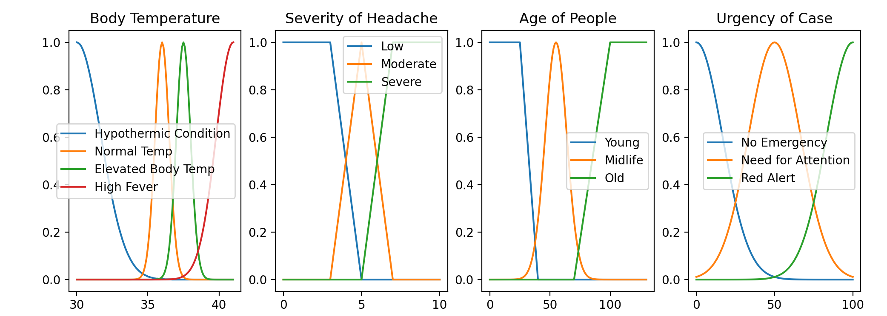

Fuzzy CourseWork
=============

For Dataset - First run [dataset.py](dataset.py) to get 1000 data instance in file [emergency_data](emergency_dataset.csv)

Then run the file [dataset_mamdani.py](dataset_mamdani.py) to get defuzzified outputs for every instance in the same [emergency_data](emergency_dataset.csv)


```
This file consists the steps to run the code for both cases Case 1 and Case 2 defined in the question
```

Case 1 - All Numeric Inputs
Files to run for this case -> [model_inference_type1_mamdani.py](model-inference_type1_mamdani.py) and [model_inference_type1_sugeno.py](model-inference_type1_sugeno.py)

Case 2 - All Interval Based Inputs
Files to run for this case -> [model_inference_type1_mamdani_interval.py](model_inference_type1_mamdani_interval.py) and [model_inference_type1_sugeno_interval.py](model-inference_type1_sugeno_interval.py)

In order to run files for case 1
-------------------------------
Step 1 -> Give numeric inputs in the command line
```
For example:
Enter a Float Range of body_temp 35
Enter a Int Range of headache 9
Enter a Int Range of age 67
```

Step 2 -> A plotted graph showing all antecedents and consequents



In order to proceed terminate this window by pressing 


After terminating wait for a few seconds and the rules screen will pop up

Step 3 -> Another graph showing all antecedents and consequents with inputs will show up


In order to proceed terminate this window by pressing 


Step 4 -> You will be shown all the rules in both models along with the output aggregation in Mamdani model.


In order to proceed terminate this window by pressing 


After that you will be returned to command line ->

Step 5 -> Here you can see the outputs ->

[For-Mamdani](https://uk.mathworks.com/help/fuzzy/types-of-fuzzy-inference-systems.html) ->
```
Centroid Defuzzification 76.9847651503233
Mean of Maxima: 80.5
First of Maxima: 61
Last of Maxima: 100
Middle of Maxima 80.5
```

[For-Sugeno](https://uk.mathworks.com/help/fuzzy/types-of-fuzzy-inference-systems.html) ->
```
Crisp Output 79.14176727950861
```
Done with Case 1

In order to run files for case 2
--------------------------------
Step 1 -> Give interval valued inputs in the command (line upper and lower bound)
```
For example: Inputs seperated with a space.
Enter a Float Range of body_temp 30 35
Enter a Int Range of headache 7 9
Enter a Int Range of age 50 67
```
Step 2, 3 and 4 and 5 are same as Case 1

Step 3 image


Done with Case 2

Installation
-----------


```pip install numpy, matplotlib, pandas, PyQt5``` 

OR

```pip3 install numpy, matplotlib, pandas, PyQt5``` 

Usage
-----
```
Python
```

#### Made By - 
###### Aditya Purswani - Student ID -> 20596344
###### Anasuya Dutta - Student ID -> 20594248

Thank You 
---------